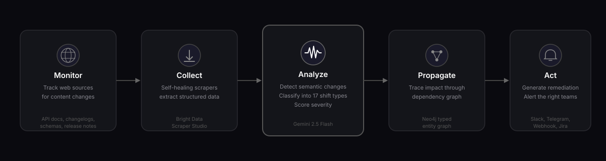
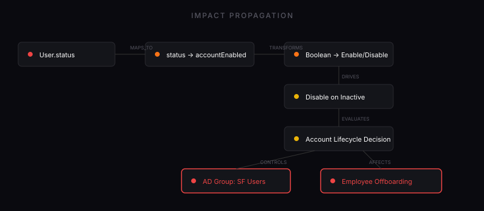

<h1 align="center">Tremor</h1>

<p align="center"><strong>Change intelligence for enterprise integrations.</strong></p>

<p align="center">
  
  
  
  
  
</p>

<p align="center">
  <a href="https://tremor-seven.vercel.app/">Live Demo</a> •
  <a href="#how-it-works">How It Works</a> •
  <a href="#example">Example</a> •
  <a href="#quick-start">Quick Start</a> •
  <a href="#api-reference">API</a> •
  <a href="#project-structure">Structure</a>
</p>

---

Tremor monitors public web artifacts — API docs, changelogs, schemas — and detects **semantic changes** that predict which integrations will break. Unlike text diffs, it understands meaning: a boolean becoming an enum, a required field appearing, an auth flow being removed. It then propagates changes through a typed dependency graph to identify every downstream system at risk.

---

## How It Works

<p align="center">
  
</p>

| Stage | What Happens |
|-------|-------------|
| **Monitor** | Bright Data's self-healing scrapers collect target pages on schedule |
| **Collect** | Version discovery detects content changes via hash comparison |
| **Analyze** | Gemini 2.5 Flash extracts semantic contracts; change engine classifies shifts into 17 types |
| **Propagate** | Neo4j impact graph traces changes through connectors → rules → decisions → business processes |
| **Act** | Domain adapters generate remediation; Slack/Telegram/webhook notifications fire |

---

## Example

Salesforce releases API v62.0. `User.status` changes from `boolean` to `enum(ACTIVE, INACTIVE, SUSPENDED)`.

```
⚠️  HIGH — STATE_SPACE_EXPANDED

Entity:       User.status
Before:       BOOLEAN (true/false)
After:        ENUM (ACTIVE, INACTIVE, SUSPENDED)
Impact:       Provisioning Connector → Lifecycle Workflow → Employee Offboarding
Risk Score:   0.85

Remediation:
  1. Update connector attribute mapping — 2-4 hours (IAM Engineering)
  2. Add SUSPENDED state handling — 1-2 hours
  3. Update lifecycle workflows — 4 hours
```

---

## Impact Graph

<p align="center">
  
</p>

One upstream change → graph traversal reveals every system at risk.

---

## Semantic Shift Taxonomy

17 types of semantic change, classified by meaning — not syntax:

| Category | Shifts |
|----------|--------|
| State Space | `STATE_SPACE_EXPANDED` · `STATE_SPACE_CONTRACTED` |
| Type System | `TYPE_CHANGED` · `NULLABILITY_CHANGED` · `CARDINALITY_CHANGED` |
| Constraints | `CONSTRAINT_ADDED` · `CONSTRAINT_REMOVED` |
| Lifecycle | `DEPRECATION_ANNOUNCED` · `BREAKING_REMOVAL` |
| Behavior | `BEHAVIOR_INVERSION` · `SCOPE_NARROWED` · `SCOPE_WIDENED` |
| Dependencies | `DEPENDENCY_ADDED` · `DEPENDENCY_REMOVED` |
| Governance | `TEMPORAL_SHIFT` · `AUTHORITY_CHANGED` · `SEMANTIC_RENAME` |

---

## Quick Start

```bash
# Install
git clone <repo-url> && cd tremor
uv sync

# Configure
cp .env.example .env   # Add GEMINI_API_KEY

# Start Neo4j
docker compose up -d neo4j

# Run
uv run uvicorn tremor.main:app --reload
```

API at `http://127.0.0.1:8000` — OpenAPI docs at `/docs`.

---

## API Reference

| Method | Endpoint | Description |
|--------|----------|-------------|
| `POST` | `/ingest/webhook` | Receive a document snapshot |
| `POST` | `/ingest/process` | Run full pipeline |
| `GET` | `/ingest/events` | List detected changes |
| `POST` | `/collect/create` | Create Bright Data scraper |
| `POST` | `/collect/trigger` | Trigger collection |
| `POST` | `/collect/heal` | Self-heal broken scraper |
| `POST` | `/graph/seed` | Seed impact graph topology |
| `GET` | `/graph/impact/{id}` | Analyze downstream impact |
| `POST` | `/adapters/analyze/iga` | IGA domain analysis |
| `POST` | `/adapters/analyze/rfp` | RFP domain analysis |
| `WS` | `/ws/events` | Real-time event stream |

---

## Project Structure

```
src/tremor/
├── main.py                    # FastAPI app entry
├── ingestion/
│   ├── gateway.py             # Webhook, dedup, pair queuing
│   ├── brightdata.py          # Bright Data CLI/API wrapper
│   └── collector.py           # Collection endpoints
├── extraction/
│   └── extractor.py           # Gemini Flash extraction + retry
├── engine/
│   ├── differ.py              # Semantic diff (17 types)
│   └── pipeline.py            # Extract → diff → impact → notify
├── graph/
│   ├── seeder.py              # IGA topology (20 nodes, 18 edges)
│   └── traversal.py           # Downstream traversal + risk scoring
├── adapters/
│   ├── iga.py                 # Identity Governance adapter
│   └── rfp.py                 # Procurement adapter
├── notifications/
│   ├── slack.py               # Slack Block Kit
│   └── telegram.py            # Telegram Bot API
└── models/
    ├── entities.py            # SemanticContract, Entity, Attribute
    ├── event.py               # ChangeEvent, SemanticShift, Severity
    └── sources.py             # Source, Snapshot, SnapshotPair
```

---

## Built With

<p align="center">
  
  
  
  
  
  
  
  
</p>

| Technology | Role |
|-----------|------|
| [Bright Data](https://brightdata.com) | Self-healing web scraping — Scraper Studio CLI |
| [Google Gemini](https://ai.google.dev) | LLM-powered semantic extraction (2.5 Flash) |
| [Neo4j](https://neo4j.com) | Impact graph traversal engine |
| [FastAPI](https://fastapi.tiangolo.com) | Async API framework |
| [Pydantic](https://pydantic.dev) | Type-safe domain models |

---

## License

MIT License. See [LICENSE](LICENSE) for details.
